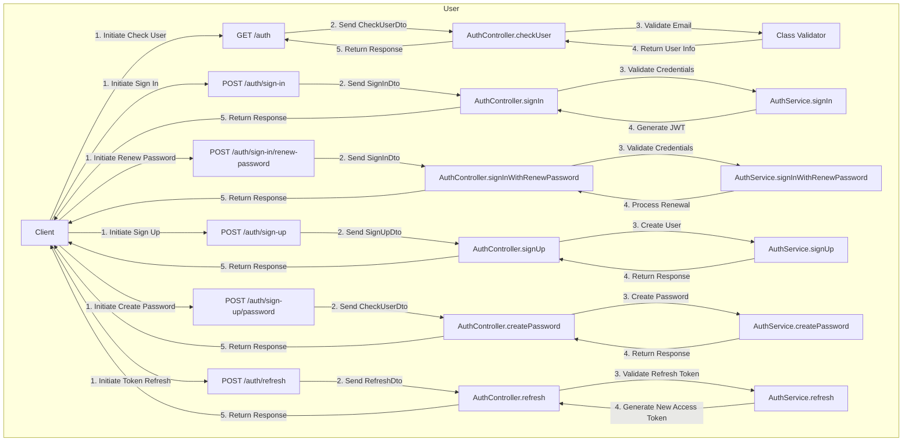

# Authentication Flow Diagram

The following diagram illustrates the authentication flow in the NestJS `AuthController`.

```mermaid
graph TD

subgraph User
  A[Client] -->|1. Initiate Check User| B[GET /auth]
  B -->|2. Send CheckUserDto| C[AuthController.checkUser]
  C -->|3. Validate Email| D[Class Validator]
  D -->|4. Return User Info| C
  C -->|5. Return Response| B
end

subgraph User
  A -->|1. Initiate Sign In| E[POST /auth/sign-in]
  E -->|2. Send SignInDto| F[AuthController.signIn]
  F -->|3. Validate Credentials| G[AuthService.signIn]
  G -->|4. Generate JWT| F
  F -->|5. Return Response| A
end

subgraph User
  A -->|1. Initiate Renew Password| H[POST /auth/sign-in/renew-password]
  H -->|2. Send SignInDto| I[AuthController.signInWithRenewPassword]
  I -->|3. Validate Credentials| J[AuthService.signInWithRenewPassword]
  J -->|4. Process Renewal| I
  I -->|5. Return Response| A
end

subgraph User
  A -->|1. Initiate Sign Up| K[POST /auth/sign-up]
  K -->|2. Send SignUpDto| L[AuthController.signUp]
  L -->|3. Create User| M[AuthService.signUp]
  M -->|4. Return Response| L
  L -->|5. Return Response| A
end

subgraph User
  A -->|1. Initiate Create Password| N[POST /auth/sign-up/password]
  N -->|2. Send CheckUserDto| O[AuthController.createPassword]
  O -->|3. Create Password| P[AuthService.createPassword]
  P -->|4. Return Response| O
  O -->|5. Return Response| A
end

subgraph User
  A -->|1. Initiate Token Refresh| Q[POST /auth/refresh]
  Q -->|2. Send RefreshDto| R[AuthController.refresh]
  R -->|3. Validate Refresh Token| S[AuthService.refresh]
  S -->|4. Generate New Access Token| R
  R -->|5. Return Response| A
end
```
