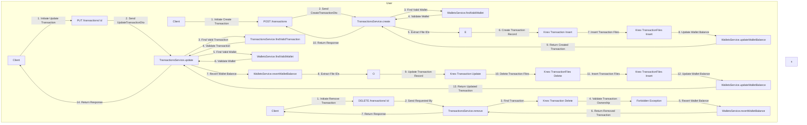

```mermaid
graph TD

subgraph User
A[Client] -->|1. Initiate Create Transaction| B[POST /transactions]
B -->|2. Send CreateTransactionDto| C[TransactionsService.create]
C -->|3. Find Valid Wallet| D[WalletsService.findValidWallet]
D -->|4. Validate Wallet| C
C -->|5. Extract File IDs| E
E -->|6. Create Transaction Record| F[Knex Transaction Insert]
F -->|7. Insert Transaction Files| G[Knex TransactionFiles Insert]
G -->|8. Update Wallet Balance| H[WalletsService.updateWalletBalance]
H -->|9. Return Created Transaction| C
C -->|10. Return Response| B
end

subgraph User
I[Client] -->|1. Initiate Update Transaction| J[PUT /transactions/:id]
J -->|2. Send UpdateTransactionDto| K[TransactionsService.update]
K -->|3. Find Valid Transaction| L[TransactionsService.findValidTransaction]
L -->|4. Validate Transaction| K
K -->|5. Find Valid Wallet| M[WalletsService.findValidWallet]
M -->|6. Validate Wallet| K
K -->|7. Revert Wallet Balance| N[WalletsService.revertWalletBalance]
N -->|8. Extract File IDs| O
O -->|9. Update Transaction Record| P[Knex Transaction Update]
P -->|10. Delete Transaction Files| Q[Knex TransactionFiles Delete]
Q -->|11. Insert Transaction Files| R[Knex TransactionFiles Insert]
R -->|12. Update Wallet Balance| S[WalletsService.updateWalletBalance]
S -->|13. Return Updated Transaction| K
K -->|14. Return Response| I
end

subgraph User
T[Client] -->|1. Initiate Remove Transaction| U[DELETE /transactions/:id]
U -->|2. Send Requested By| V[TransactionsService.remove]
V -->|3. Find Transaction| W[Knex Transaction Delete]
W -->|4. Validate Transaction Ownership| X[Forbidden Exception]
X -->|5. Revert Wallet Balance| Y[WalletsService.revertWalletBalance]
Y -->|6. Return Removed Transaction| V
V -->|7. Return Response| T
end
s
```
