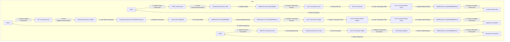

```mermaid
graph TD

subgraph User
  A[Client] -->|1. Initiate Create Transaction| B[POST /transactions]
  B -->|2. Send CreateTransactionDto| C[TransactionsService.create]
  C -->|3. Validate Wallet| D[WalletsService.findValidWallet]
  D -->|4. Create Transaction Record| E[Knex Transaction Insert]
  E -->|5. Extract File IDs| F[File IDs Extracted]
  F -->|6. Insert Transaction Files| G[Knex TransactionFiles Insert]
  G -->|7. Update Wallet Balance| H[WalletsService.updateWalletBalance]
  H -->|8. Return Created Transaction| I[Created Transaction]
  I -->|9. Return Response| A
end

subgraph User
  J[Client] -->|1. Initiate Update Transaction| K[PUT /transactions/:id]
  K -->|2. Send UpdateTransactionDto| L[TransactionsService.update]
  L -->|3. Find Valid Transaction| M[TransactionsService.findValidTransaction]
  M -->|4. Validate Transaction| N[Transaction Validated]
  N -->|5. Find Valid Wallet| O[WalletsService.findValidWallet]
  O -->|6. Revert Wallet Balance| P[WalletsService.revertWalletBalance]
  P -->|7. Update Transaction Record| Q[Knex Transaction Update]
  Q -->|8. Delete Transaction Files| R[Knex TransactionFiles Delete]
  R -->|9. Insert Transaction Files| S[Knex TransactionFiles Insert]
  S -->|10. Update Wallet Balance| T[WalletsService.updateWalletBalance]
  T -->|11. Return Updated Transaction| U[Updated Transaction]
  U -->|12. Return Response| J
end

subgraph User
  V[Client] -->|1. Initiate Remove Transaction| W[DELETE /transactions/:id]
  W -->|2. Send Requested By| X[TransactionsService.remove]
  X -->|3. Find Transaction| Y[Knex Transaction Delete]
  Y -->|4. Validate Transaction Ownership| Z[Ownership Validated]
  Z -->|5. Revert Wallet Balance| AA[WalletsService.revertWalletBalance]
  AA -->|6. Return Removed Transaction| BB[Removed Transaction]
  BB -->|7. Return Response| V
end
```
